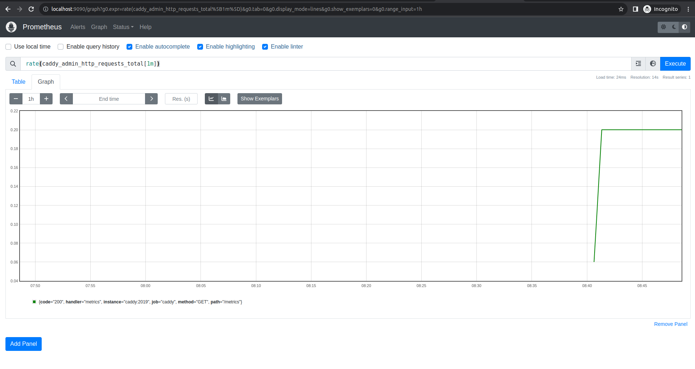

# Recogizer DevOps/Cloud Engineer Technical Challenge - Monitoring Solution

## Introduction:

This documentation guides you in establishing a centralized monitoring solution for dockerized applications using Prometheus, Grafana, and Alertmanager. Learn to collect metrics efficiently, create dynamic dashboards, and manage alerts effectively, providing a comprehensive monitoring stack for enhanced observability in cloud-native environments.

## Components
- [Prometheus](#prometheus)
- [Alert Manager](#alert-manager)
- [Grafana](#grafana)

I am employing a consolidated Docker Compose file to orchestrate the deployment of various components, all within a dedicated Docker network. This strategic setup enables us to independently manage our monitoring solution, ensuring seamless onboarding of new application logs in the future.

## Prerequisites

Before proceeding with the deployment of Prometheus, certain adjustments need to be made in both the Caddy Docker Compose file and the Caddy configuration file.

I have made a minor change in the Caddy configuration file to configure the Caddy admin endpoint to specify that Caddy should expose its admin interface on port 2019. The admin endpoint allows you to interact with the Caddy server, providing information and control over its configuration and status.

```json
# Caddy config file
{
  servers {
      metrics
  }
  admin :2019
}

:80 {
  reverse_proxy http-dummy-service:8080
}
```
To streamline monitoring configuration, I made a slight adjustment to the Caddy Docker Compose file. Hostnames for services have been introduced, and a static name for the Docker network has been assigned. This specific network name will be referenced as an external network in the Prometheus deployment Docker Compose.

This approach ensures consistency, preventing potential issues when executing the Caddy Docker Compose from different directories. Without specifying a static network name, Docker appends the directory name to the network name, necessitating manual updates in the Prometheus Docker Compose each time Caddy is run from a new directory.

```yaml
# Caddy docker-compose.yaml
version: '3'

services:
  http-dummy-service:
    container_name: http-dummy
    image: rgjcastrillon/http-dummy-service:0.1.0
    networks:
      - backend
    hostname: http-dummy

  caddy:
    container_name: caddy
    image: caddy:latest
    ports:
      - "8080:80"
      - "2019:2019"
    networks:
      - backend
    hostname: caddy
    volumes:
      - ./Caddyfile:/etc/caddy/Caddyfile:ro
networks:
  backend:
    name: backend
    driver: bridge

```
I included **"backend"** as the network name to serve as a reference in our future Docker Compose files. This ensures consistency in network naming conventions.

If this step is overlooked during the Docker Compose execution, the network name would default to something like **"directory-name_backend."** In our specific setup, we want the network name to be simply **"backend."**

```bash
# Example Output for docker network
SahirAbbas@sahir-pc:~/workshop/rg-devops-challenge$ docker network ls
NETWORK ID     NAME                       DRIVER    SCOPE
c4391b50d970   backend                    bridge    local
874c2aafe5b4   directory-name_backend     bridge    local
```

Once these changes are implemented, we can proceed to deploy the Caddy server for testing.

```bash
SahirAbbas@sahir-pc:~/workshop/rg-devops-challenge$ docker-compose up -d 
[+] Running 2/3
 ⠼ Network backend       Created                                                                                                                                        0.5s 
 ✔ Container http-dummy  Started                                                                                                                                        0.3s 
 ✔ Container caddy       Started                                                                                                                                        0.4s 
SahirAbbas@sahir-pc:~/workshop/rg-devops-challenge$ docker ps
CONTAINER ID   IMAGE                                    COMMAND                  CREATED         STATUS             PORTS                                                                                                NAMES
756112576a0e   caddy:latest                             "caddy run --config …"   7 seconds ago   Up 6 seconds       443/tcp, 443/udp, 0.0.0.0:2019->2019/tcp, :::2019->2019/tcp, 0.0.0.0:8080->80/tcp, :::8080->80/tcp   caddy
f26f5e2192e7   rgjcastrillon/http-dummy-service:0.1.0   "./dummy-service"        7 seconds ago   Up 6 seconds       8080/tcp                                                                                             http-dummy

```

Once the application is up and running, we can verify the retrieval of metrics from the scrape target by using the CURL command: `curl -X GET localhost:2019/metrics`.

```bash
SahirAbbas@sahir-pc:~/workshop/rg-devops-challenge$ curl -X GET localhost:2019/metrics
# HELP caddy_reverse_proxy_upstreams_healthy Health status of reverse proxy upstreams.
# TYPE caddy_reverse_proxy_upstreams_healthy gauge
caddy_reverse_proxy_upstreams_healthy{upstream="http-dummy-service:8080"} 1
# HELP go_build_info Build information about the main Go module.
# TYPE go_build_info gauge
go_build_info{checksum="",path="",version=""} 1
# HELP go_gc_duration_seconds A summary of the pause duration of garbage collection cycles.
# TYPE go_gc_duration_seconds summary
go_gc_duration_seconds{quantile="0"} 4.399e-05
go_gc_duration_seconds{quantile="0.25"} 5.4163e-05
go_gc_duration_seconds{quantile="0.5"} 0.000216528
go_gc_duration_seconds{quantile="0.75"} 0.00026455
go_gc_duration_seconds{quantile="1"} 0.00026455
go_gc_duration_seconds_sum 0.000579231
go_gc_duration_seconds_count 4
# HELP go_goroutines Number of goroutines that currently exist.
# TYPE go_goroutines gauge
go_goroutines 16
# HELP go_info Information about the Go environment.
# TYPE go_info gauge
....
....
# TYPE promhttp_metric_handler_requests_in_flight gauge
promhttp_metric_handler_requests_in_flight 1
# HELP promhttp_metric_handler_requests_total Total number of scrapes by HTTP status code.
# TYPE promhttp_metric_handler_requests_total counter
promhttp_metric_handler_requests_total{code="200"} 0
promhttp_metric_handler_requests_total{code="500"} 0
promhttp_metric_handler_requests_total{code="503"} 0
SahirAbbas@sahir-pc:~/workshop/rg-devops-challenge$
```

## Prometheus

Prometheus is an open-source monitoring tool for tracking and alerting system metrics. It excels in handling time-series data, offering flexibility in querying, visualization, and alerting for efficient system monitoring.

I am deploying Prometheus to monitor Caddy. Prometheus will scrape metrics from the Caddy scrap target, accessible at the /metrics endpoint (http://caddy:2019/metrics) of the Caddy server.


In the Prometheus Docker Compose file, I've established a link with the **backend** network and incorporated the Prometheus configuration (prometheus.yml). Specifically, I've designated the Caddy container name as the scrape target, enabling Prometheus to retrieve metrics from Caddy.

```yaml
# Prometheus docker-compose.yaml
version: '3'

prometheus:
    image: prom/prometheus:latest
    container_name: prometheus
    volumes:
      - ./prometheus:/etc/prometheus
    command:
      - '--config.file=/etc/prometheus/prometheus.yml'
      - '--storage.tsdb.path=/prometheus'
    ports:
      - 9090:9090
    networks:
      - backend
      - monitoring
    restart: always
networks:
  backend:
    external: true
  monitoring:
    name: monitoring
    driver: bridge
```

In the Prometheus deployment, I ensure persistence of configuration changes by binding the prometheus.yml file from the host directory named "Prometheus." This approach allows for convenient updates and maintains the configuration across deployments.


In the Prometheus configuration file (monitoring/prometheus/prometheus.yml), I've incorporated the Caddy scrape target to fetch metrics from Caddy.

```yaml
global:
  scrape_interval: 5s

scrape_configs:
- job_name: 'prometheus'
  static_configs:
  - targets: ['localhost:9090']

- job_name: 'caddy'
  static_configs:
  - targets: ['caddy:2019']
```
Once the Prometheus configuration is set up, we can proceed to deploy Prometheus for testing.

```bash
SahirAbbas@sahir-pc:~/workshop/rg-devops-challenge/monitoring$ docker-compose up -d 
[+] Running 1/2
 ⠏ Network monitoring      Created                                                                                                                                      0.9s 
 ✔ Container prometheus    Started 
```
We can confirm whether Docker is up and running by using the command `docker ps`.
```bash
CONTAINER ID   IMAGE                                    COMMAND                  CREATED          STATUS          PORTS                                                                                                NAMES
7458292ae9dc   prom/prometheus:latest                   "/bin/prometheus --c…"   3 minutes ago    Up 3 minutes    0.0.0.0:9090->9090/tcp, :::9090->9090/tcp                                                            prometheus
756112576a0e   caddy:latest                             "caddy run --config …"   23 minutes ago   Up 23 minutes   443/tcp, 443/udp, 0.0.0.0:2019->2019/tcp, :::2019->2019/tcp, 0.0.0.0:8080->80/tcp, :::8080->80/tcp   caddy
f26f5e2192e7   rgjcastrillon/http-dummy-service:0.1.0   "./dummy-service"        23 minutes ago   Up 23 minutes   8080/tcp                                                                                             http-dummy
```

After deploying Prometheus, we can confirm the population of metrics by executing the query rate(caddy_admin_http_requests_total[1m]) from the Prometheus web UI http://localhost:9090/.




After completing the testing phase, we can dismantle the Prometheus deployment. Later, we will proceed to deploy the comprehensive solution using the consolidated Docker Compose file.

```bash
SahirAbbas@sahir-pc:~/workshop/rg-devops-challenge/monitoring$ docker-compose down 
[+] Running 2/2
 ✔ Container prometheus    Removed                                                                                                                                      1.1s 
 ✔ Network monitoring      Removed 
```
## Alert Manager
Alertmanager is a key component of the Prometheus monitoring system, responsible for managing and routing alerts generated by Prometheus servers. It streamlines the alerting workflow by providing features like deduplication, grouping, and customizable notification routing to various channels.

To integrate Alertmanager into our monitoring solution, I will enhance the existing Docker Compose file initially created for Prometheus deployment. After the update, the Docker Compose configuration will appear as follows.

```yaml
version: '3.8'

services:
  prometheus:
    image: prom/prometheus:latest
    container_name: prometheus
    volumes:
      - ./prometheus:/etc/prometheus
    command:
      - '--config.file=/etc/prometheus/prometheus.yml'
      - '--storage.tsdb.path=/prometheus'
    ports:
      - 9090:9090
    networks:
      - backend
      - monitoring
    restart: always

  alertmanager:
    image: prom/alertmanager:latest
    container_name: alertmanager
    volumes:
      - ./alertmanager:/etc/alertmanager
    command:
      - '--config.file=/etc/alertmanager/config.yml'
      - '--storage.path=/alertmanager'
    ports:
      - 9093:9093
    networks:
      - monitoring
    restart: always

networks:
  backend:
    external: true
  monitoring:
    name: monitoring
    driver: bridge

```
We need to create a configuration file for Alertmanager to set up the SMTP settings. In this solution, alert notifications will be sent via email. I have stored the configuration file in the **"alertmanager"** directory with the filename "config.yml".

```yaml
global:
  smtp_smarthost: "smtp.gmail.com:587"
  smtp_from: "<sender_email>"
  smtp_auth_username: "<sender_email>"
  smtp_auth_password: "<sender_password>"
  smtp_auth_identity: ""

route:
  receiver: "email-notifications"

receivers:
- name: "email-notifications"
  email_configs:
  - to: "<receiver_email>"
    from: "<sender_email>"
    smarthost: "smtp.gmail.com:587"
    auth_username: "<sender_email>"
    auth_password: "<sender_password>"
    auth_identity: ""
    send_resolved: true
```

I'm utilizing Gmail as an SMTP relay. To configure Gmail for this purpose, you'll need to generate a Gmail app password. Follow the provided [link](https://support.google.com/mail/answer/185833?hl=en&source=post_page-----16df870144a4--------------------------------) for instructions on creating one. Once the app password is generated, update the Alertmanager config.yml file with these details.

We need to establish a connection between Prometheus and Alertmanager and configure alerts in Prometheus. Alertmanager will then be responsible for sending email notifications to end users based on the alerts triggered by Prometheus.

To accomplish this, we must create an **alert.rules.yaml** file in the Prometheus directory and update the **prometheus.yml** file accordingly.

```yaml
# alert.rules.yaml sample
groups:
- name: caddymonitoring
  rules:
  # Prometheus Target Down
  - alert: TargetDown
    expr: up == 0
    for: 5m
    labels:
      severity: critical
    annotations:
      summary: "Prometheus target is down"
      description: "The Prometheus target {{ $labels.instance }} is down."
```
After creating the alerts.rules.yml file, update the prometheus.yml file to reference the rules and establish the connection with Alertmanager.

```yaml
# prometheus.yml
global:
  scrape_interval: 5s

scrape_configs:
- job_name: 'prometheus'
  static_configs:
  - targets: ['localhost:9090']

- job_name: 'caddy'
  static_configs:
  - targets: ['caddy:2019']

rule_files:
- 'alert.rules.yml'

alerting:
  alertmanagers:
  - static_configs:
    - targets: ['alertmanager:9093']
```
In the current Docker Compose file, I've configured a volume to ensure the persistence of configuration files. This allows us to conveniently update the Alertmanager config.yml and alerts.rules.yml whenever necessary, facilitating the seamless addition or modification of alerts.

### Configred Alerts
| Alert Name | Description | Thresold |  Severity   |
|----------|----------|----------|-----|
| TargetDown | This alert is designed to monitor the status of Prometheus scrape targets. If any of the scrape targets go offline, the alert will be triggered. | 5m | critical |
| HighCPUUsage | This alert is configured to monitor the CPU usage.  | 5m | critical |
| HighMemoryUsage | This alert is configured to monitor the Memory usage. | 5m | critical |
| HighGoroutineCount | This alert is configured to monitor the number of goroutines. | 5m | critical |
| HighGC_Duration | This alert is configured to monitor the garbage collection duration | 5m | warning |
| HighErrorRate | This alert is configured to monitor the error rate for HTTP requests. | 1m | critical |
| HighHeapObjects | This alert is configured to monitor the number of allocated heap objects. | 5m | warning |
| ReverseProxyUpstreamUnhealthy | This alert is configured to monitor the unhealthy reverse proxy upstreams. | 5m | critical |
| HighFileDescriptors | This alert is configured to monitor the number of open file descriptors | 5m | critical |
| ProcessRestart | This alert is configured to monitor the process restart | 5m | critical |
| High404ErrorRate | This alert is configured to monitor the 404 error | 1m | critical |

### Alerts and Significance
| Alert Name | Significance |
|----------|----------|
| TargetDown | This alert is significant because it notifies you when the Prometheus target, which is the Caddy instance in this case, is unreachable or experiencing issues. Detecting and responding to such situations promptly is crucial for maintaining the health and reliability of your monitoring infrastructure, allowing you to address potential issues in the monitored Caddy instance.|
| HighCPUUsage | This alert is significant because it notifies you when the CPU usage on the monitored system is consistently above 90% for an extended period. High CPU usage can lead to performance degradation, increased response times, and potential service disruptions. Detecting and addressing this condition proactively helps ensure the stability and optimal performance of the system. |
| HighMemoryUsage | This alert is significant because it notifies you when the heap memory usage on the monitored system is consistently above 90% for the last 5 minutes. High heap memory usage can lead to performance issues, application instability, and potential outages. Detecting and addressing this condition proactively helps ensure the stability and optimal functioning of the system. |
| HighGoroutineCount | In the context of Go programming language, a goroutine is a lightweight thread of execution. Goroutines are used for concurrent programming in Go, allowing developers to execute functions concurrently. The "High Goroutine Count" alert is significant because an excessive number of goroutines can lead to increased resource consumption and potential performance issues. Detecting and addressing this condition helps maintain the stability and optimal functioning of the monitored system. |
| HighGC_Duration | Garbage Collection (GC): In computing, garbage collection is a process by which a runtime system automatically deallocates memory that is no longer in use by the program. In the context of Go programming language, the Go runtime includes an automatic garbage collector to manage memory. The "High GC Duration" alert is significant because prolonged garbage collection durations can impact application performance and responsiveness. Detecting and addressing this condition helps ensure efficient memory management and overall system stability. |
| HighErrorRate | This alert is significant because it notifies you when the error rate for HTTP requests on the monitored Caddy instance is consistently above 5% for the last 5 minutes. A high error rate can indicate issues with server-side processing, resource limitations, or other factors affecting the successful handling of incoming requests. Detecting and addressing this condition promptly helps maintain the reliability and performance of the web server. |
| HighHeapObjects | This alert is significant because a high number of heap objects may indicate potential memory issues in the monitored system. It suggests that the system is allocating and using a large number of memory blocks, and this could lead to increased memory consumption and potential performance degradation. Detecting and addressing this condition proactively helps ensure efficient memory management and system stability. |
| ReverseProxyUpstreamUnhealthy | This alert is significant because it notifies you when one or more of the reverse proxy upstreams in the Caddy server are unhealthy. Unhealthy upstreams can result in service disruptions, errors, or degraded performance for the applications relying on Caddy for reverse proxying. Detecting and addressing this condition promptly is crucial for maintaining the reliability and availability of the reverse proxy infrastructure. |
| HighFileDescriptors | File descriptors are crucial for managing I/O operations efficiently and are a fundamental concept in Unix-based systems. They play a significant role in communication between processes, reading from and writing to files, and managing network connections. Monitoring the number of open file descriptors is important to prevent resource exhaustion and ensure the proper functioning of applications and services. |
| ProcessRestart | ProcessRestart alert is significant for maintaining service continuity, ensuring operational awareness, diagnosing potential issues, monitoring resources effectively, and enabling proactive maintenance of the system. It serves as an early warning system, helping administrators take timely actions to address and resolve any issues affecting the stability and performance of the monitored process. |
| High404ErrorRate | High404ErrorRate alert helps ensure the health and reliability of the web server by proactively notifying administrators of a significant number of 404 errors, enabling them to take corrective actions to improve the user experience and address underlying issues. |

After configuring Alertmanager, we can simply execute docker-compose up to initiate and check the alerts along with their configurations.

```bash
SahirAbbas@sahir-pc:~/workshop/rg-devops-challenge/monitoring$ docker-compose up -d 
[+] Running 2/3
 ⠧ Network monitoring      Created                                                                                                                                      0.7s 
 ✔ Container alertmanager  Started                                                                                                                                      0.5s 
 ✔ Container grafana       Started
```
Once Alert Manager and Prometheus are up and running, you can access them using the respective URLs.

|  |  |
|----------|----------|
| Alert Manager | http://localhost:9093 |
| Prometheus | http://localhost:9090 |

To check the status of the scrape targets, navigate to the "Targets" section under the "Status" tab by accessing the Prometheus URL.


To verify the proper configuration of alert rules, navigate to the "Rules" section under the "Status" tab by accessing the Prometheus URL.


To monitor the status of alerts, visit the "Alerts" tab by accessing the Prometheus URL.


To inspect the status and current configuration of Alert Manager, navigate to the "Status" tab by accessing the Alert Manager URL.


Triggered alerts will be displayed on the Alertmanager console as well.


In the event of triggered alerts, Alert Manager will dispatch email notifications to the configured email addresses. It will also send resolve notifications when the issues are resolved.


After completing the testing phase, we can dismantle the deployment. Later, we will proceed to deploy the comprehensive solution using the consolidated Docker Compose file.

## Grafana

Grafana is an open-source platform used for visualizing and analyzing metrics, logs, and data from various sources. It provides customizable dashboards, making it a popular tool for monitoring and observability in DevOps and system management.

I utilize Grafana to visualize Caddy metrics sourced from Prometheus.

To integrate Grafana into our monitoring solution, I will enhance the existing Docker Compose file initially created for Prometheus deployment. After the update, the Docker Compose configuration will appear as follows.

```yaml
version: '3.8'

services:
  prometheus:
    image: prom/prometheus:latest
    container_name: prometheus
    volumes:
      - ./prometheus:/etc/prometheus
    command:
      - '--config.file=/etc/prometheus/prometheus.yml'
      - '--storage.tsdb.path=/prometheus'
    ports:
      - 9090:9090
    networks:
      - backend
      - monitoring
    restart: always

  alertmanager:
    image: prom/alertmanager:latest
    container_name: alertmanager
    volumes:
      - ./alertmanager:/etc/alertmanager
    command:
      - '--config.file=/etc/alertmanager/config.yml'
      - '--storage.path=/alertmanager'
    ports:
      - 9093:9093
    networks:
      - monitoring
    restart: always

  grafana:
    image: grafana/grafana:latest
    container_name: grafana
    env_file:
      - .env_grafana
    volumes:
      - ./grafana:/var/lib/grafana
      - ./grafana/provisioning:/etc/grafana/provisioning
      - ./dashboard:/etc/grafana/dashboards
    ports:
      - 3000:3000
    networks:
      - monitoring
    restart: always

networks:
  backend:
    external: true
  monitoring:
    name: monitoring
    driver: bridge
```

In this setup, I bind data source configuration and dashboards as volumes, ensuring the persistence of configuration and dashboards. This approach facilitates the seamless relocation of the monitoring solution without concerns about data loss or configuration disruption.

```yaml
volumes:
  - ./grafana:/var/lib/grafana
  - ./grafana/provisioning:/etc/grafana/provisioning
  - ./dashboard:/etc/grafana/dashboards
```
The data source configurations are housed in **./grafana/provisioning/prometheus.yml**, facilitating seamless Prometheus configuration as a data source on the fly, without requiring manual intervention. Additionally, dashboard configurations are stored in the **./dashboard** directory, enabling the deployment of ready-to-use Caddy dashboards on the fly.

```yaml
#grafana/provisioning/datasources/prometheus.yml
apiVersion: 1

datasources:
- name: Prometheus
  type: prometheus
  access: proxy
  orgId: 1
  url: http://prometheus:9090
  basicAuth: false
  isDefault: true
```

Furthermore, I am conveying the Grafana admin password and data path through environment variables using the .env_grafana file. This approach simplifies the process of changing passwords and other configurations in the future. If additional variables need to be passed, updating the .env_grafana file exclusively suffices for Grafana variables.

```bash
# .env_grafana

GF_SECURITY_ADMIN_PASSWORD=admin
GF_SECURITY_ALLOW_EMBEDDING=true
GF_PATHS_DATA=/var/lib/grafana
```
Prior to deployment, it is imperative to adjust the ownership and permissions of the Grafana directory. Failure to do so may result in the Grafana Docker container encountering issues.

```bash
sudo chown -R 472:472 ./grafana
sudo chmod -R 0770 ./grafana
```
The command sudo chown -R 472:472 ./grafana changes the ownership of the ./grafana

472:472: Specifies the user and group ownership to be set. In our case, we have to set  both the user ID (UID) and group ID (GID) to 472

The command sudo chmod -R 0770 ./grafana changes the permissions of the ./grafana directory and its contents.

This command grants the owner and group full read, write, and execute permissions while explicitly denying any permission to others.

After configuring the permissions, the monitoring solution can be deployed effortlessly using the command `docker-compose up -d`.

```bash
SahirAbbas@sahir-pc:~/workshop/rg-devops-challenge/monitoring$ docker-compose up -d 
[+] Running 3/4
 ⠧ Network monitoring      Created                                                                                                                                      0.7s 
 ✔ Container alertmanager  Started                                                                                                                                      0.5s 
 ✔ Container grafana       Started                                                                                                                                      0.3s 
 ✔ Container prometheus    Started
```
To verify the status of the containers, execute the `docker ps` command. If all components are up and running, access the Grafana UI through http://127.0.0.1:3000.

```bash
CONTAINER ID   IMAGE                                    COMMAND                  CREATED       STATUS       PORTS                                                                                                NAMES
1e0ff2db3ddc   grafana/grafana:latest                   "/run.sh"                2 hours ago   Up 2 hours   0.0.0.0:3000->3000/tcp, :::3000->3000/tcp                                                            grafana
4711f03c66bf   prom/alertmanager:latest                 "/bin/alertmanager -…"   2 hours ago   Up 2 hours   0.0.0.0:9093->9093/tcp, :::9093->9093/tcp                                                            alertmanager
e582f10f677e   prom/prometheus:latest                   "/bin/prometheus --c…"   2 hours ago   Up 2 hours   0.0.0.0:9090->9090/tcp, :::9090->9090/tcp                                                            prometheus
756112576a0e   caddy:latest                             "caddy run --config …"   5 hours ago   Up 5 hours   443/tcp, 443/udp, 0.0.0.0:2019->2019/tcp, :::2019->2019/tcp, 0.0.0.0:8080->80/tcp, :::8080->80/tcp   caddy
f26f5e2192e7   rgjcastrillon/http-dummy-service:0.1.0   "./dummy-service"        5 hours ago   Up 5 hours   8080/tcp                                                                                             http-dummy
```

Given that we configured the dashboard and Prometheus as data sources during deployment, accessing the dashboard is straightforward by logging into Grafana. Navigate to the "Dashboards" section, select the Caddy Dashboard, and experience a comprehensive display of valuable information.


